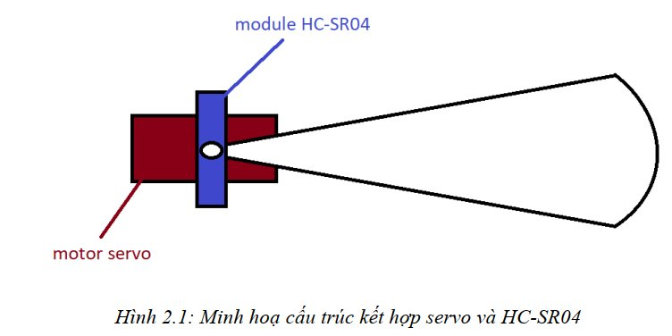
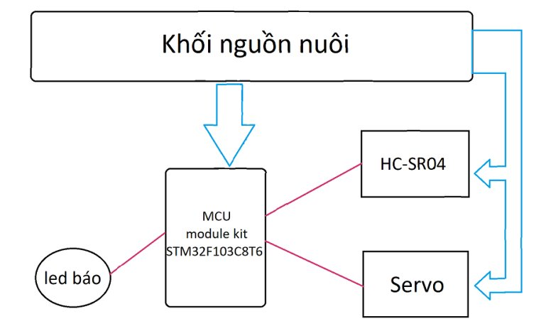
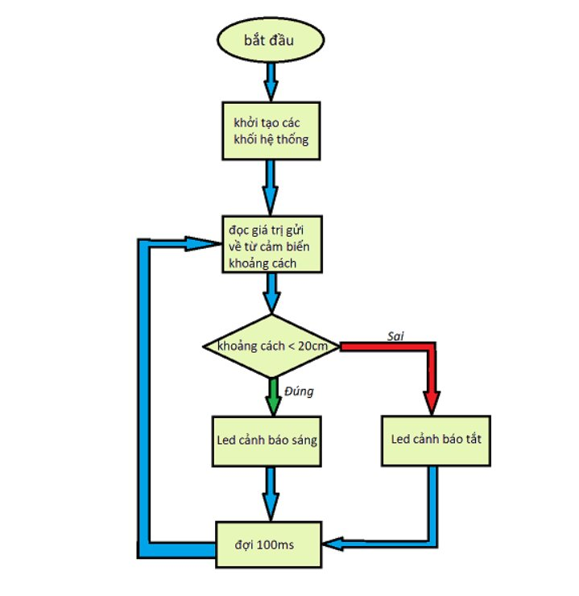

# Car Reverse Warning

### Mô tả hoạt động của hệ thống
- Hệ thống hoạt động dựa trên sự kết hợp của Module đo khoảng cách bằng song siêu âm HC-SR04, Motor servo và MCU STM32.
- Module HC-SR04 gắn vào servo để tạo một góc quét nhỏ, HC-SR04 sẽ đo khoảng cách đến vật cản mỗi 200ms.
- MCU STM32 sẽ đọc khoảng cách đến vật cản, nếu khoảng cách đến vật cản < 20cm thì đèn báo động sẽ sáng để cảnh báo cho người lái xe.

### Linh kiện sử dụng 

| **Module** | **Chức năng** |
|:------|:-----|
| STM32F103C8T6 |  |
| Module HC-SR04 | Đọc đo khoảng cách tới vật cản thông qua cảm biến |
| Module Servo SG-90 | Điều khiển bằng PWM, quét liên tục một góc khoảng 50 |

### Sơ đồ khối

### Lưu đồ thuật toán

